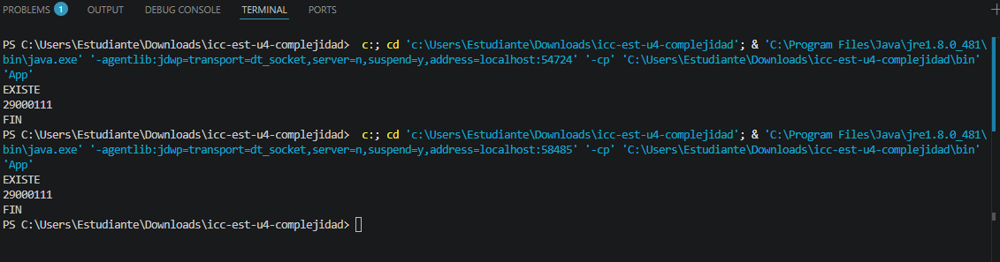

# Práctica: 04.01 Complejidad Proyect JAVA

## Datos del Estudiante
- **Nombre:** Sebastian Arenillas
- **Curso:** Es
- **Fecha:** 14/04/2026

---

## 1. icc-est-u4-complejidad

**Fecha:** 14/04/2026

**Descripción:** Creamos el proyecto y subimos a github

---

## 2. icc-est-u4-complejidad

**Fecha:** 15/04/26
**Descripción:** Creamos la clase estudiantes con datos aleatorios para
buscar y optimizar la busqueda.

